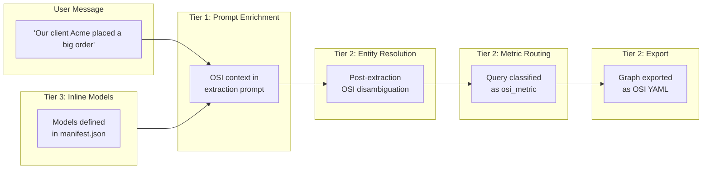

# OSI Manifest Integration -- Making It Transparent

> **Status: IMPLEMENTED.** All three tiers are built and working. The `osi_config` section is a validated top-level manifest field. Inline `semantic_models` are supported (Tier 3). Models are persisted in a MongoDB-backed store (`{slug}_osi_models` collection) with SHA-256 hash-based seeding for zero-restart updates. See `examples/advanced/sso-multi-app/apps/sso-app-3/manifest.json` for a production example with 10 datasets, 12 relationships, 6 metrics, and 515 synonyms.

How the `manifest.json` system can make OSI integration as simple as adding one line -- or as powerful as defining full semantic models inline.

> **Context**: This document builds on [OSI.md](OSI.md) (strategic analysis) and [OSI_PROPOSED_INTEGRATION.md](OSI_PROPOSED_INTEGRATION.md) (engineering blueprint). Here we focus specifically on the manifest-driven developer experience.

---

## Table of Contents

1. [Three Tiers of Integration](#1-three-tiers-of-integration)
2. [Tier 1: One-Liner](#2-tier-1-one-liner)
3. [Tier 2: First-Class Config](#3-tier-2-first-class-config)
4. [Tier 3: Inline Semantic Models](#4-tier-3-inline-semantic-models)
5. [Auto-Discovery Convention](#5-auto-discovery-convention)
6. [Complete Manifest Examples](#6-complete-manifest-examples)
7. [Feature Matrix](#7-feature-matrix)
8. [Initialization Order](#8-initialization-order)

---

## 1. Three Tiers of Integration

Progressive disclosure: start with zero config, add power as needed.

| Tier | What You Add | What You Get | Effort |
|------|-------------|--------------|--------|
| **1** | 1 line in `graph_config` | Prompt enrichment, domain-specific entity types | Minimal |
| **2** | 5-8 lines as `osi_config` | + Entity resolution, metric routing, export API | Low |
| **3** | 20-50 lines with inline models | + Full semantic models in manifest, no external files | Medium |

All three tiers are **backward compatible**. Existing manifests work exactly as before. OSI features are entirely opt-in.

---

## 2. Tier 1: One-Liner

### The Idea

Add a single field to the existing `graph_config`. The graph service auto-loads OSI YAML files from that path, enriches extraction prompts with domain vocabulary, and extends the node type registry. No new infrastructure. No new config sections. One line.

### Before

A standard graph-enabled manifest (from `examples/basic/graphs-mdb/manifest.json`):

```json
{
  "schema_version": "2.0",
  "slug": "graphs_mdb",
  "name": "Graphs MDB Example",
  "status": "active",

  "graph_config": {
    "enabled": true,
    "auto_extract": true,
    "node_types": ["person", "interest", "event", "location", "organization", "product", "concept"]
  },

  "llm_config": {
    "enabled": true,
    "providers": {
      "chat": "openai/gpt-4o"
    }
  },

  "embedding_config": {
    "enabled": true,
    "default_embedding_model": "text-embedding-3-small"
  }
}
```

### After (One Line Added)

```json
{
  "schema_version": "2.0",
  "slug": "graphs_mdb",
  "name": "Graphs MDB Example",
  "status": "active",

  "graph_config": {
    "enabled": true,
    "auto_extract": true,
    "node_types": ["person", "interest", "event", "location", "organization", "product", "concept"],
    "osi_models_path": "semantic_models/"
  },

  "llm_config": {
    "enabled": true,
    "providers": {
      "chat": "openai/gpt-4o"
    }
  },

  "embedding_config": {
    "enabled": true,
    "default_embedding_model": "text-embedding-3-small"
  }
}
```

### What Happens Under the Hood

1. `GraphService.__init__()` reads `config.get("osi_models_path")`
2. Loads all `.yaml` / `.yml` files from that directory
3. Extracts dataset names, field names, relationship types, metrics, and `ai_context.synonyms`
4. Appends OSI dataset names to `self.node_types` (deduplicates automatically)
5. Formats OSI context and stores it as `self._osi_prompt_context`
6. On every `extract_graph_from_text()` call, the system prompt includes OSI context:

```
ORGANIZATION SEMANTIC MODELS (prefer these when matching entities):
- Dataset "customer": fields [customer_name, email, region]. Synonyms: ["client", "account"]
- Dataset "store_sales": fields [sale_date, amount]. Synonyms: ["order", "transaction"]
- Relationship: customer -> store_sales (store_sales_to_customer)
- Metric "total_sales". Synonyms: ["total revenue", "gross sales"]

When you identify entities, prefer mapping to these known dataset types.
```

### Schema Addition

One property added to `graph_config` in `manifest.py`:

```python
"osi_models_path": {
    "type": "string",
    "description": "Path to directory containing OSI semantic model YAML files. "
                   "Models are auto-loaded and used to enrich extraction prompts."
}
```

### What This Gets You

- Domain-specific entity types in extraction (e.g., `customer` instead of generic `organization`)
- Synonym-based entity recognition ("client" maps to `customer`)
- OSI-defined relationship types guide edge creation
- Zero changes to node schema, edge schema, or query pipeline
- Fully backward compatible -- remove the line and everything works as before

---

## 3. Tier 2: First-Class Config

### The Idea

A dedicated `osi_config` section at the manifest top level, following the established pattern of `graph_config`, `memory_config`, `llm_config`, and `embedding_config`. Each boolean flag progressively enables features.

### The Config

```json
{
  "osi_config": {
    "enabled": true,
    "models_path": "semantic_models/",
    "entity_resolution": true,
    "metric_routing": true,
    "export_enabled": true,
    "sync_interval_minutes": 60
  }
}
```

### Field Reference

| Field | Type | Default | Description |
|-------|------|---------|-------------|
| `enabled` | boolean | `false` | Master switch for OSI integration |
| `models_path` | string | `null` | Path to directory containing OSI YAML files |
| `models` | string[] | `[]` | Specific YAML files to load (alternative to directory) |
| `entity_resolution` | boolean | `true` | Post-extraction: check extracted nodes against OSI datasets for disambiguation |
| `metric_routing` | boolean | `false` | Enable governed metric detection in query classification |
| `export_enabled` | boolean | `false` | Mount `/api/osi/export` endpoint for graph-to-YAML export |
| `sync_interval_minutes` | integer | `60` | How often to re-check model files for changes (0 = no polling) |

### Progressive Feature Activation

Each field enables a specific capability. You only turn on what you need:

```json
// Stage 1: Just prompt enrichment
"osi_config": {
  "enabled": true,
  "models_path": "semantic_models/"
}
```

```json
// Stage 2: + Entity resolution (better disambiguation)
"osi_config": {
  "enabled": true,
  "models_path": "semantic_models/",
  "entity_resolution": true
}
```

```json
// Stage 3: + Metric routing (detect governed metric queries)
"osi_config": {
  "enabled": true,
  "models_path": "semantic_models/",
  "entity_resolution": true,
  "metric_routing": true
}
```

```json
// Stage 4: + Export (publish discovered knowledge as OSI YAML)
"osi_config": {
  "enabled": true,
  "models_path": "semantic_models/",
  "entity_resolution": true,
  "metric_routing": true,
  "export_enabled": true
}
```

### Schema Definition

Added to `MANIFEST_SCHEMA_V2["properties"]` in `manifest.py`:

```python
"osi_config": {
    "type": "object",
    "properties": {
        "enabled": {
            "type": "boolean",
            "default": False,
            "description": "Enable Open Semantic Interchange integration"
        },
        "models_path": {
            "type": "string",
            "description": "Path to directory containing OSI semantic model YAML files"
        },
        "models": {
            "type": "array",
            "items": {"type": "string"},
            "description": "Specific OSI model YAML files to load"
        },
        "entity_resolution": {
            "type": "boolean",
            "default": True,
            "description": "Enable post-extraction entity resolution against OSI definitions"
        },
        "metric_routing": {
            "type": "boolean",
            "default": False,
            "description": "Enable query routing for OSI-defined governed metrics"
        },
        "export_enabled": {
            "type": "boolean",
            "default": False,
            "description": "Enable graph-to-OSI export API endpoint"
        },
        "sync_interval_minutes": {
            "type": "integer",
            "minimum": 0,
            "default": 60,
            "description": "Polling interval (minutes) for OSI model file changes. 0 = disabled"
        },
        "semantic_models": {
            "type": "array",
            "items": {"type": "object"},
            "description": "Inline OSI semantic model definitions (alternative to external files)"
        }
    },
    "additionalProperties": False,
    "description": "Open Semantic Interchange (OSI) integration configuration"
}
```

### Relationship to `graph_config`

When both `osi_config` and `graph_config.osi_models_path` are present, `osi_config` takes precedence. The Tier 1 `osi_models_path` shorthand is syntactic sugar -- it is equivalent to:

```json
// Tier 1 shorthand:
"graph_config": { "osi_models_path": "semantic_models/" }

// Is equivalent to:
"osi_config": { "enabled": true, "models_path": "semantic_models/" }
```

---

## 4. Tier 3: Inline Semantic Models

### The Idea

Define OSI semantic models **directly inside the manifest** -- no external YAML files needed. This follows the established MDB-Engine pattern of `initial_data` (inline seed data) and `managed_indexes` (inline index definitions).

### The Config

```json
{
  "osi_config": {
    "enabled": true,
    "entity_resolution": true,
    "metric_routing": true,
    "export_enabled": true,

    "semantic_models": [
      {
        "name": "sales_analytics",
        "description": "Core sales and customer analytics model",
        "ai_context": {
          "synonyms": ["sales model", "revenue model", "CRM data"]
        },

        "datasets": [
          {
            "name": "customer",
            "source": "analytics.public.customers",
            "primary_key": ["customer_id"],
            "fields": [
              {
                "name": "customer_name",
                "expression": {"dialects": [{"dialect": "ANSI_SQL", "expression": "name"}]},
                "ai_context": {"synonyms": ["client", "account", "buyer", "contact"]}
              },
              {
                "name": "email",
                "expression": {"dialects": [{"dialect": "ANSI_SQL", "expression": "email"}]}
              },
              {
                "name": "region",
                "expression": {"dialects": [{"dialect": "ANSI_SQL", "expression": "region"}]},
                "dimension": {"is_time": false},
                "ai_context": {"synonyms": ["area", "territory", "location"]}
              },
              {
                "name": "tier",
                "expression": {"dialects": [{"dialect": "ANSI_SQL", "expression": "account_tier"}]},
                "ai_context": {"synonyms": ["level", "segment", "plan"]}
              }
            ],
            "ai_context": {
              "synonyms": ["client", "account", "buyer"]
            }
          },
          {
            "name": "order",
            "source": "analytics.public.orders",
            "primary_key": ["order_id"],
            "fields": [
              {
                "name": "order_date",
                "expression": {"dialects": [{"dialect": "ANSI_SQL", "expression": "ordered_at"}]},
                "dimension": {"is_time": true},
                "ai_context": {"synonyms": ["date", "when", "purchase date"]}
              },
              {
                "name": "order_total",
                "expression": {"dialects": [{"dialect": "ANSI_SQL", "expression": "amount_usd"}]},
                "ai_context": {"synonyms": ["amount", "total", "price", "cost"]}
              },
              {
                "name": "is_food_order",
                "expression": {"dialects": [{"dialect": "ANSI_SQL", "expression": "is_food_order"}]},
                "ai_context": {"synonyms": ["food", "food order"]}
              }
            ],
            "ai_context": {
              "synonyms": ["sale", "transaction", "purchase"]
            }
          },
          {
            "name": "product",
            "source": "analytics.public.products",
            "primary_key": ["product_id"],
            "fields": [
              {
                "name": "product_name",
                "expression": {"dialects": [{"dialect": "ANSI_SQL", "expression": "name"}]},
                "ai_context": {"synonyms": ["item", "SKU", "offering"]}
              },
              {
                "name": "category",
                "expression": {"dialects": [{"dialect": "ANSI_SQL", "expression": "category"}]},
                "ai_context": {"synonyms": ["type", "kind", "group"]}
              }
            ],
            "ai_context": {
              "synonyms": ["item", "offering", "SKU"]
            }
          }
        ],

        "relationships": [
          {
            "name": "order_to_customer",
            "from": "order",
            "to": "customer",
            "from_columns": ["customer_id"],
            "to_columns": ["customer_id"]
          },
          {
            "name": "order_to_product",
            "from": "order",
            "to": "product",
            "from_columns": ["product_id"],
            "to_columns": ["product_id"]
          }
        ],

        "metrics": [
          {
            "name": "total_revenue",
            "expression": {
              "dialects": [
                {"dialect": "ANSI_SQL", "expression": "SUM(order.amount_usd)"}
              ]
            },
            "description": "Total revenue across all orders",
            "ai_context": {
              "synonyms": ["revenue", "total sales", "gross sales", "income"]
            }
          },
          {
            "name": "order_count",
            "expression": {
              "dialects": [
                {"dialect": "ANSI_SQL", "expression": "COUNT(order.order_id)"}
              ]
            },
            "description": "Total number of orders",
            "ai_context": {
              "synonyms": ["number of orders", "order volume", "transaction count"]
            }
          },
          {
            "name": "average_order_value",
            "expression": {
              "dialects": [
                {"dialect": "ANSI_SQL", "expression": "AVG(order.amount_usd)"}
              ]
            },
            "description": "Average revenue per order",
            "ai_context": {
              "synonyms": ["AOV", "avg order", "average transaction"]
            }
          }
        ]
      }
    ]
  }
}
```

### Why Inline?

MDB-Engine already establishes this pattern:

- **`managed_indexes`** defines MongoDB indexes inline in the manifest (no external files)
- **`initial_data`** defines seed data inline in the manifest
- **`auth.users.demo_users`** defines demo user accounts inline

Inline semantic models follow the same philosophy: **the manifest is the single source of truth for app configuration**. For small-to-medium models (which most conversational apps will have), external YAML files are unnecessary overhead.

### When to Use External Files Instead

Use `models_path` (Tier 1/2) instead of inline `semantic_models` when:

- The OSI models are managed by a separate data team
- The models are version-controlled independently
- The models are shared across multiple MDB-Engine apps
- The models are large (50+ datasets, hundreds of fields)

### Combining Inline and External

Both can coexist. External files are loaded first, then inline models are merged:

```json
"osi_config": {
  "enabled": true,
  "models_path": "semantic_models/",
  "semantic_models": [
    {
      "name": "app_specific_model",
      "datasets": [...]
    }
  ]
}
```

The external files provide the organization's governed models. The inline model adds app-specific extensions. This is the flywheel in action: the org publishes governed models, the app enriches them with domain context.

---

## 5. Auto-Discovery Convention

### Convention Over Configuration

If a `semantic_models/` directory exists alongside the app's `manifest.json`, OSI models are auto-loaded even without explicit config. This mirrors how `graph_config` defaults to `enabled: true` -- the engine does the smart thing by default.

### Discovery Logic

```python
# Pseudo-code for auto-discovery
def discover_osi_models(manifest_path: str, manifest: dict) -> str | None:
    """Auto-discover OSI models using convention over configuration."""

    # 1. Explicit config takes priority
    osi_config = manifest.get("osi_config", {})
    if osi_config.get("models_path"):
        return osi_config["models_path"]

    # 2. graph_config shorthand
    graph_config = manifest.get("graph_config", {})
    if graph_config.get("osi_models_path"):
        return graph_config["osi_models_path"]

    # 3. Convention: check for semantic_models/ directory
    manifest_dir = Path(manifest_path).parent
    convention_path = manifest_dir / "semantic_models"
    if convention_path.is_dir() and any(convention_path.glob("*.yaml")):
        logger.info(f"Auto-discovered OSI models at {convention_path}")
        return str(convention_path)

    # 4. No models found
    return None
```

### Directory Structure

```
my_app/
  manifest.json          # No OSI config needed
  web.py
  semantic_models/       # <-- Auto-discovered
    revenue_model.yaml
    customer_model.yaml
```

The engine detects the `semantic_models/` directory automatically and loads all YAML files. No manifest changes required. To disable auto-discovery, explicitly set `osi_config.enabled: false`.

### Explicit Opt-Out

```json
{
  "osi_config": {
    "enabled": false
  }
}
```

This prevents auto-discovery even if the `semantic_models/` directory exists.

---

## 6. Complete Manifest Examples

### Example 1: Minimal Bot + OSI (Tier 1)

Based on `examples/basic/memory_quickstart/manifest.json` -- the simplest possible memory bot, now with OSI-enriched graph extraction:

```json
{
  "schema_version": "2.0",
  "slug": "my_bot",
  "name": "Memory Bot with OSI",

  "llm_config": {
    "enabled": true,
    "default_model": "openai/gpt-4o-mini"
  },

  "embedding_config": {
    "enabled": true,
    "default_embedding_model": "text-embedding-3-small"
  },

  "memory_config": {
    "enabled": true,
    "provider": "cognitive",
    "collection_name": "memories",
    "embedding_model_dims": 1536,
    "infer": true
  },

  "graph_config": {
    "enabled": true,
    "osi_models_path": "semantic_models/"
  }
}
```

**Total addition**: 1 line (`osi_models_path`). The graph service was already enabled by default.

---

### Example 2: Full Cognitive Engine + OSI (Tier 2)

Based on `examples/basic/memory_kitchen_sink/manifest.json` -- the full "Perfect Brain" cognitive architecture, now with OSI entity resolution and metric routing:

```json
{
  "schema_version": "2.0",
  "slug": "perfect_brain",
  "name": "Perfect Brain with OSI Integration",
  "status": "active",

  "osi_config": {
    "enabled": true,
    "models_path": "semantic_models/",
    "entity_resolution": true,
    "metric_routing": true,
    "export_enabled": true
  },

  "memory_config": {
    "enabled": true,
    "provider": "cognitive",
    "collection_name": "memories",
    "embedding_model": "text-embedding-3-large",
    "chat_model": "gpt-4o",
    "embedding_model_dims": 3072,
    "async_mode": true,
    "enable_cognitive": true,
    "max_depth": 200,
    "similarity_threshold": 0.90,
    "spreading_activation": true,
    "salience_gate": true,
    "salience_threshold": 0.3,
    "cognitive": {
      "enabled": true,
      "emotion": {"enabled": true, "flashbulb_threshold": 0.7},
      "conflict_resolution": {"enabled": true, "similarity_threshold": 0.85},
      "pruning": {"enabled": true, "max_capacity": 10000, "strategy": "soft_delete"}
    },
    "categories": {
      "enabled": true,
      "custom_categories": ["biographical", "preferences", "work", "health", "finance"]
    },
    "reflection": {
      "enabled": true,
      "interval_hours": 24,
      "store_reflections": true
    },
    "persona": {
      "name": "Atlas",
      "role": "Cognitive memory companion with perfect recall",
      "traits": ["precise", "empathetic", "proactive"],
      "communication_style": "warm but analytical"
    }
  },

  "graph_config": {
    "enabled": true,
    "collection_name": "kg",
    "auto_extract": true,
    "default_max_depth": 3,
    "embedding_dims": 3072,
    "node_types": [
      "person", "organization", "location", "event",
      "interest", "concept", "product", "skill",
      "project", "goal"
    ]
  },

  "graphrag_config": {
    "enabled": true,
    "community_detection": {"enabled": true, "min_community_size": 2},
    "query_classification": {"enabled": true, "use_llm": true, "cache_results": true}
  },

  "llm_config": {
    "enabled": true,
    "providers": {
      "chat": "openai/gpt-4o",
      "extraction": "openai/gpt-4o-mini"
    }
  },

  "embedding_config": {
    "enabled": true,
    "default_embedding_model": "text-embedding-3-large"
  }
}
```

**Total addition**: 7 lines (`osi_config` section). Everything else is existing config.

---

### Example 3: Enterprise with Inline Models (Tier 3)

A production-grade manifest for a sales intelligence app with inline OSI semantic models, SSO auth, and the full cognitive stack:

```json
{
  "schema_version": "2.0",
  "slug": "sales_intel",
  "name": "Sales Intelligence Platform",
  "description": "AI-powered sales assistant with governed business metrics and conversational memory",
  "status": "active",
  "developer_id": "platform@company.com",

  "auth": {
    "mode": "shared",
    "auth_hub_url": "http://localhost:8000",
    "roles": ["sales_rep", "manager", "admin"],
    "require_role": "sales_rep",
    "csrf_protection": {"enabled": true}
  },

  "osi_config": {
    "enabled": true,
    "entity_resolution": true,
    "metric_routing": true,
    "export_enabled": true,
    "sync_interval_minutes": 30,

    "semantic_models": [
      {
        "name": "crm_analytics",
        "description": "CRM and pipeline analytics for the sales organization",
        "ai_context": {"synonyms": ["CRM", "pipeline", "sales data"]},

        "datasets": [
          {
            "name": "account",
            "source": "warehouse.sales.accounts",
            "primary_key": ["account_id"],
            "fields": [
              {
                "name": "account_name",
                "expression": {"dialects": [{"dialect": "ANSI_SQL", "expression": "name"}]},
                "ai_context": {"synonyms": ["company", "client", "customer", "org"]}
              },
              {
                "name": "industry",
                "expression": {"dialects": [{"dialect": "ANSI_SQL", "expression": "industry"}]},
                "ai_context": {"synonyms": ["vertical", "sector"]}
              },
              {
                "name": "arr",
                "expression": {"dialects": [{"dialect": "ANSI_SQL", "expression": "annual_recurring_revenue"}]},
                "ai_context": {"synonyms": ["annual revenue", "ARR", "contract value"]}
              },
              {
                "name": "health_score",
                "expression": {"dialects": [{"dialect": "ANSI_SQL", "expression": "health_score"}]},
                "ai_context": {"synonyms": ["account health", "risk score"]}
              }
            ],
            "ai_context": {"synonyms": ["company", "client", "customer"]}
          },
          {
            "name": "opportunity",
            "source": "warehouse.sales.opportunities",
            "primary_key": ["opp_id"],
            "fields": [
              {
                "name": "deal_name",
                "expression": {"dialects": [{"dialect": "ANSI_SQL", "expression": "name"}]},
                "ai_context": {"synonyms": ["deal", "opportunity", "prospect"]}
              },
              {
                "name": "stage",
                "expression": {"dialects": [{"dialect": "ANSI_SQL", "expression": "stage"}]},
                "ai_context": {"synonyms": ["pipeline stage", "deal stage", "status"]}
              },
              {
                "name": "amount",
                "expression": {"dialects": [{"dialect": "ANSI_SQL", "expression": "amount"}]},
                "ai_context": {"synonyms": ["deal size", "value", "contract amount"]}
              },
              {
                "name": "close_date",
                "expression": {"dialects": [{"dialect": "ANSI_SQL", "expression": "close_date"}]},
                "dimension": {"is_time": true},
                "ai_context": {"synonyms": ["expected close", "target date"]}
              }
            ],
            "ai_context": {"synonyms": ["deal", "prospect", "pipeline item"]}
          },
          {
            "name": "contact",
            "source": "warehouse.sales.contacts",
            "primary_key": ["contact_id"],
            "fields": [
              {
                "name": "full_name",
                "expression": {"dialects": [{"dialect": "ANSI_SQL", "expression": "first_name || ' ' || last_name"}]},
                "ai_context": {"synonyms": ["name", "person", "rep", "stakeholder"]}
              },
              {
                "name": "title",
                "expression": {"dialects": [{"dialect": "ANSI_SQL", "expression": "job_title"}]},
                "ai_context": {"synonyms": ["role", "position", "job title"]}
              }
            ],
            "ai_context": {"synonyms": ["person", "stakeholder", "champion", "decision maker"]}
          }
        ],

        "relationships": [
          {"name": "opp_to_account", "from": "opportunity", "to": "account", "from_columns": ["account_id"], "to_columns": ["account_id"]},
          {"name": "contact_to_account", "from": "contact", "to": "account", "from_columns": ["account_id"], "to_columns": ["account_id"]},
          {"name": "opp_to_contact", "from": "opportunity", "to": "contact", "from_columns": ["primary_contact_id"], "to_columns": ["contact_id"]}
        ],

        "metrics": [
          {
            "name": "total_pipeline",
            "expression": {"dialects": [{"dialect": "ANSI_SQL", "expression": "SUM(opportunity.amount)"}]},
            "description": "Total pipeline value across all open opportunities",
            "ai_context": {"synonyms": ["pipeline", "total pipeline", "pipeline value", "weighted pipeline"]}
          },
          {
            "name": "total_arr",
            "expression": {"dialects": [{"dialect": "ANSI_SQL", "expression": "SUM(account.annual_recurring_revenue)"}]},
            "description": "Total annual recurring revenue across all accounts",
            "ai_context": {"synonyms": ["ARR", "annual revenue", "recurring revenue", "total revenue"]}
          },
          {
            "name": "win_rate",
            "expression": {"dialects": [{"dialect": "ANSI_SQL", "expression": "COUNT(CASE WHEN opportunity.stage = 'Closed Won' THEN 1 END) * 100.0 / NULLIF(COUNT(opportunity.opp_id), 0)"}]},
            "description": "Percentage of opportunities that result in closed-won deals",
            "ai_context": {"synonyms": ["close rate", "conversion rate", "win percentage"]}
          }
        ]
      }
    ]
  },

  "memory_config": {
    "enabled": true,
    "provider": "cognitive",
    "collection_name": "memories",
    "embedding_model": "text-embedding-3-small",
    "memory_llm_model": "gemini/gemini-2.5-flash-lite",
    "embedding_model_dims": 1536,
    "infer": true,
    "async_mode": true,
    "enable_cognitive": true,
    "cognitive": {
      "enabled": true,
      "emotion": {"enabled": true},
      "conflict_resolution": {"enabled": true}
    },
    "categories": {
      "enabled": true,
      "custom_categories": ["account_intel", "deal_updates", "competitive", "relationships"]
    },
    "persona": {
      "name": "Scout",
      "role": "Sales intelligence analyst with deep CRM knowledge",
      "traits": ["data-driven", "concise", "proactive"],
      "expertise": ["pipeline analysis", "account strategy", "competitive intelligence"]
    }
  },

  "graph_config": {
    "enabled": true,
    "auto_extract": true,
    "default_max_depth": 3,
    "node_types": [
      "person", "organization", "opportunity", "product",
      "concept", "event", "location", "competitor"
    ]
  },

  "graphrag_config": {
    "enabled": true,
    "community_detection": {"enabled": true},
    "query_classification": {"enabled": true, "use_llm": true}
  },

  "llm_config": {
    "enabled": true,
    "providers": {
      "chat": "gemini/gemini-2.5-flash-lite",
      "extraction": "gemini/gemini-2.5-flash-lite"
    }
  },

  "embedding_config": {
    "enabled": true,
    "default_embedding_model": "text-embedding-3-small"
  },

  "cors": {
    "enabled": true,
    "allow_origins": ["http://localhost:3000", "http://localhost:8000"],
    "allow_credentials": true,
    "allow_methods": ["*"],
    "allow_headers": ["*"]
  }
}
```

**What this manifest does**:

1. A sales rep chats naturally: *"Had a great call with Sarah from Acme. She's excited about the enterprise plan but worried about the migration timeline."*

2. The extraction engine (enriched with OSI context) produces:
   - `account:acme` (recognized via "company" synonym on the `account` dataset)
   - `contact:sarah` (recognized via "stakeholder" synonym on the `contact` dataset)
   - `opportunity:acme_enterprise` (recognized via "deal" synonym on `opportunity`)
   - Edge: `sarah --champion_of--> acme_enterprise`
   - Edge: `acme_enterprise --opp_to_account--> acme` (using OSI relationship name)

3. Later, the rep asks: *"What's our total pipeline?"*
   - Query classifier detects `total_pipeline` metric (matched via "pipeline" synonym)
   - Response includes the governed metric definition: `SUM(opportunity.amount)`
   - Plus graph context: "Your conversations show Acme's enterprise deal is progressing well, but the migration timeline is a concern..."

---

## 7. Feature Matrix

Every manifest field mapped to its system effect:

| Manifest Field | Location | System Effect | Code Target |
|---|---|---|---|
| `graph_config.osi_models_path` | Tier 1 | Load YAML, enrich extraction prompts, extend node types | `graph/service.py` `__init__`, `graph/extraction.py` |
| `osi_config.enabled` | Tier 2 | Master switch for all OSI features | `core/service_initialization.py` |
| `osi_config.models_path` | Tier 2 | Load external YAML files into registry | `osi/loader.py`, `osi/registry.py` |
| `osi_config.models` | Tier 2 | Load specific YAML files (array of paths) | `osi/loader.py` |
| `osi_config.entity_resolution` | Tier 2 | Post-extraction disambiguation against OSI datasets | `graph/extraction.py`, `osi/resolver.py` |
| `osi_config.metric_routing` | Tier 2 | Add `osi_metric` query classification, detect governed metrics | `graph/query_classifier.py`, `graph/search.py` |
| `osi_config.export_enabled` | Tier 2 | Mount `/api/osi/export` endpoint | `osi/exporter.py`, `osi/routes.py` |
| `osi_config.sync_interval_minutes` | Tier 2 | Background polling for model file changes | `osi/watcher.py` |
| `osi_config.semantic_models` | Tier 3 | Inline OSI models parsed directly from manifest | `osi/registry.py` |
| *(auto-discovery)* | Convention | Auto-load from `semantic_models/` directory | `osi/loader.py` |

### What Each Feature Does to the Pipeline



---

## 8. Initialization Order

OSI integration slots into the existing service initialization chain. The key constraint: OSI must be ready **before** the graph service, because the graph service uses OSI context for prompt enrichment.

### Current Order

```
1. initialize_graph_callback()    # Graph service
2. initialize_memory_callback()   # Memory service (uses graph for GraphRAG)
```

### Proposed Order

```
1. initialize_osi_callback()      # NEW: Load and index OSI models
2. initialize_graph_callback()    # Graph service (receives OSI registry)
3. initialize_memory_callback()   # Memory service (uses graph + OSI for context)
```

### Wiring

```python
# In app_lifecycle.py register_app():
async def initialize_osi_callback(slug: str, osi_config: dict) -> None:
    if self._service_initializer:
        await self._service_initializer.initialize_osi_service(slug, osi_config)

# In app_registration.py register_app():
osi_config = manifest.get("osi_config")
if osi_config and osi_config.get("enabled", False):
    await initialize_osi_callback(slug, osi_config)

# Then existing:
if graph_config.get("enabled", True):
    await initialize_graph_callback(slug, graph_config)
```

The graph service initialization receives the OSI registry:

```python
# In service_initialization.py initialize_graph_service():
osi_registry = self._osi_registries.get(slug)
if osi_registry:
    service_config["_osi_registry"] = osi_registry
    logger.info(f"Graph service for {slug} will use OSI registry")
```

### Tier 1 Shortcut

For Tier 1 (no `osi_config` section), the graph service handles OSI loading directly in its `__init__`:

```python
# In graph/service.py __init__():
osi_models_path = self.config.get("osi_models_path")
if osi_models_path:
    from .osi_loader import load_osi_models, format_osi_for_prompt
    self._osi_models = load_osi_models(osi_models_path)
    self._osi_prompt_context = format_osi_for_prompt(self._osi_models)
```

This means Tier 1 works with zero changes to the initialization pipeline -- it is entirely self-contained within the graph service.

---

## Summary

| Approach | Config | What You Get |
|----------|--------|-------------|
| **Do nothing** | (none) | `semantic_models/` auto-discovered if directory exists |
| **Tier 1** | `graph_config.osi_models_path` | Prompt enrichment + extended node types |
| **Tier 2** | `osi_config` section | + Entity resolution + metric routing + export |
| **Tier 3** | `osi_config.semantic_models` | + Inline models, no external files |

The design follows MDB-Engine's core philosophy: **sensible defaults, progressive disclosure, declarative configuration**. OSI integration should feel as natural as adding `memory_config` or `graph_config` to a manifest -- because it follows exactly the same patterns.

---

## References

- [OSI.md](OSI.md) -- Strategic analysis of OSI and MDB-Engine
- [OSI_PROPOSED_INTEGRATION.md](OSI_PROPOSED_INTEGRATION.md) -- Engineering blueprint (5 phases)
- [GRAPH_101.md](GRAPH_101.md) -- Knowledge graph architecture reference
- [OSI Specification](https://github.com/open-semantic-interchange/OSI/blob/main/core-spec/spec.md)
- `mdb_engine/core/manifest.py` -- `MANIFEST_SCHEMA_V2` definition
- `mdb_engine/core/service_initialization.py` -- Service wiring
- `mdb_engine/core/app_lifecycle.py` -- Initialization callbacks
- `mdb_engine/graph/service.py` -- `GraphService.__init__`, `DEFAULT_NODE_TYPES`
- `mdb_engine/graph/prompts.py` -- Extraction prompts
- `examples/basic/memory_quickstart/manifest.json` -- Minimal manifest pattern
- `examples/basic/memory_kitchen_sink/manifest.json` -- Full cognitive pattern
- `examples/advanced/sso-multi-app/apps/sso-app-3/manifest.json` -- Production pattern
